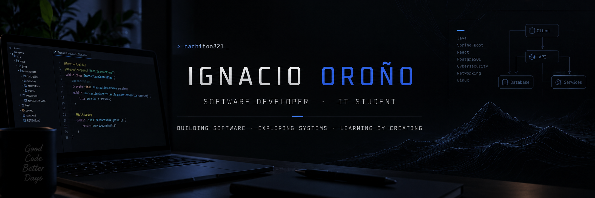

  

---

### 👨‍💻 About Me

I'm an Information Technology student at UTN, focused on building a strong foundation across software development and computer systems.

- 💻 I enjoy building full-stack applications and understanding how things work beyond the code
- ☕ Java and Spring Boot are currently at the core of my backend projects
- 🌐 Interested in software engineering, networking and cybersecurity
- 🤝 Experienced in collaborative university projects using Git and GitHub
- 🚀 Always looking for opportunities to turn what I learn into working software

### 🛠️ Tech Stack

#### Languages

#### Frameworks & Libraries

#### Databases

#### Tools

---

## 🚀 Featured Projects

### 🏠 [HogarYA — Real Estate Management System](https://github.com/Nachitoo321/HogarYA)

**University Team Project**

Real estate management system developed collaboratively as part of a university project.

`Java` `Spring Boot` `Thymeleaf` `Spring Data JPA` `MySQL`

---

### 🛸 Rick & Morty Web App

**University Team Project**

Web application based on the Rick and Morty universe, developed collaboratively as part of a university project.

`PHP` `MySQL` `HTML` `CSS`

---

### 🎵 [Brisa & Ritmo — Vanguard LCD Widget](https://github.com/Nachitoo321/Vanguard-Now-Playing)

**Personal Project**

Custom LCD widget for the Corsair Vanguard Pro 96 that displays weather, time and currently playing media through Corsair iCUE.

`JavaScript` `HTML` `CSS` `Open-Meteo API` `iCUE`

---

### 💰 Nexoza

**Personal Project · Work in Progress 🚧**

Personal finance management application designed to manage accounts, transactions, categories and installment payments.

`Java` `Spring Boot` `React` `PostgreSQL`

---

## 🚀 Currently

- 💰 Building **Nexoza**, a personal finance management application
- 🎓 Studying **Information Technology** at UTN
- 🌱 Deepening my knowledge of **Java, Spring Boot and React**
- 🔐 Exploring **Cybersecurity and Networking**
- 🛠️ Building projects to turn what I learn into real-world experience

## 🤝 Connect with Me

  

